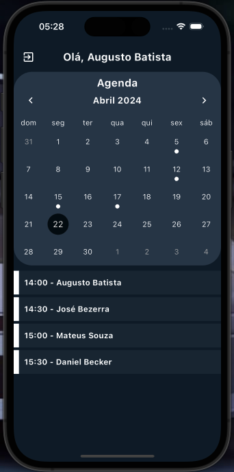
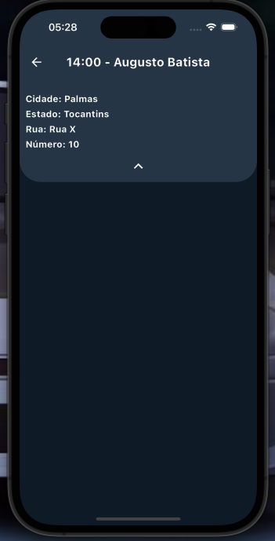

 <h1 align="center">
    Experweb
</h1>

<p align="center">
  <a href="https://dart.dev/">
    
  </a>
  <a href="https://flutter.dev/">
    
  </a>
</p>

## To Do

- [The Application](#application)
- [Techs](#techs)
- [Clone and use for Free](#clone)

<a id="application"></a>

## The Application

<h3 align="center">
    
      
    
    
</h3>


<a id="techs"></a>

## Techs

The project was developed with the technologies below:

- [Dart](https://dart.dev/)
- [Flutter](https://flutter.dev/)


<a id="clone"></a>

## Clone this repo

1. Clone :

```sh
  git clone https://github.com/Augustob790/Experweb_test.git
```

2. Go to folder:

```sh
  cd experweb_app
```

3. Execute in terminal:

```sh
  flutter pub get && flutter run      
```

## License

This project is under MIT LICENSE. for more details follow the link: [LICENSE](LICENSE).


